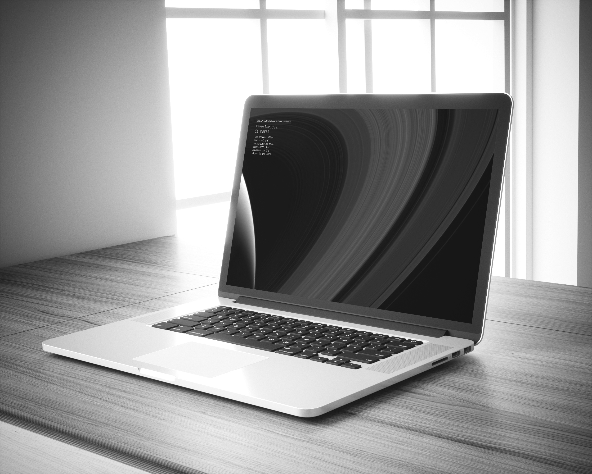
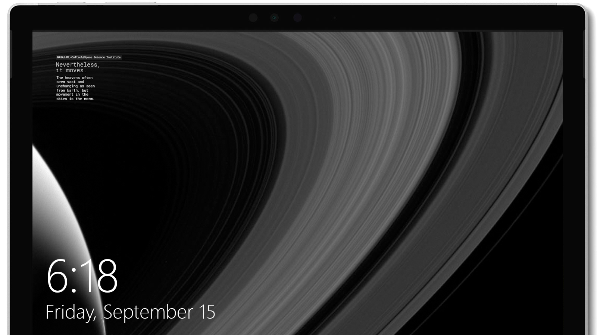

<h1 align=center>MKRhere/Stuff</h1>

Some templates and throwaway stuff, free for use. Unlicensed.

<h3 align=center>Cassini-Saturn wallpaper pack</h3>

<a href="https://www.behance.net/gallery/56777859/CassiniSaturn-wallpaper-pack">Check the showcase at Behance!</a>

#### Available Sizes

[Download All](https://github.com/MKRhere/stuff/releases/tag/cassini.saturn)

Desktop/Landscape

[2736 x 1824 (Surface)](https://github.com/MKRhere/stuff/blob/telegram.chat/img/cassini/Nevertheless.it.moves.2736.1824.landscape.surfacepro.png) | [1920 x 1080 (HD Desktop)](https://github.com/MKRhere/stuff/blob/telegram.chat/img/cassini/Nevertheless.it.moves.1920.1080.landscape.png) | [1366 x 768](https://github.com/MKRhere/stuff/blob/telegram.chat/img/cassini/Nevertheless.it.moves.1366.768.landscape.png) | [1024 x 768](https://github.com/MKRhere/stuff/blob/telegram.chat/img/cassini/Nevertheless.it.moves.1024.768.landscape.png)

Mobile/Portrait:

[1440 x 2560](https://github.com/MKRhere/stuff/blob/telegram.chat/img/cassini/Nevertheless.it.moves.1440.2560.portrait.mobile.png) | [1080 x 1920 (HD Mobile)](https://github.com/MKRhere/stuff/blob/telegram.chat/img/cassini/Nevertheless.it.moves.1080.1920.portrait.png)

Profile/Square:

[2048 x 2048]() | [1024 x 1024]() | [512 x 512] ()

<h3 align=center>Telegram chat template</h3>

#### Gravit Designer Files:

[Telegram chat template](https://github.com/MKRhere/stuff/blob/master/templates/Telegram%20chat.gvdesign)

[Single message bubble](https://github.com/MKRhere/stuff/blob/master/templates/Telegram%20message%20bubble.gvdesign)